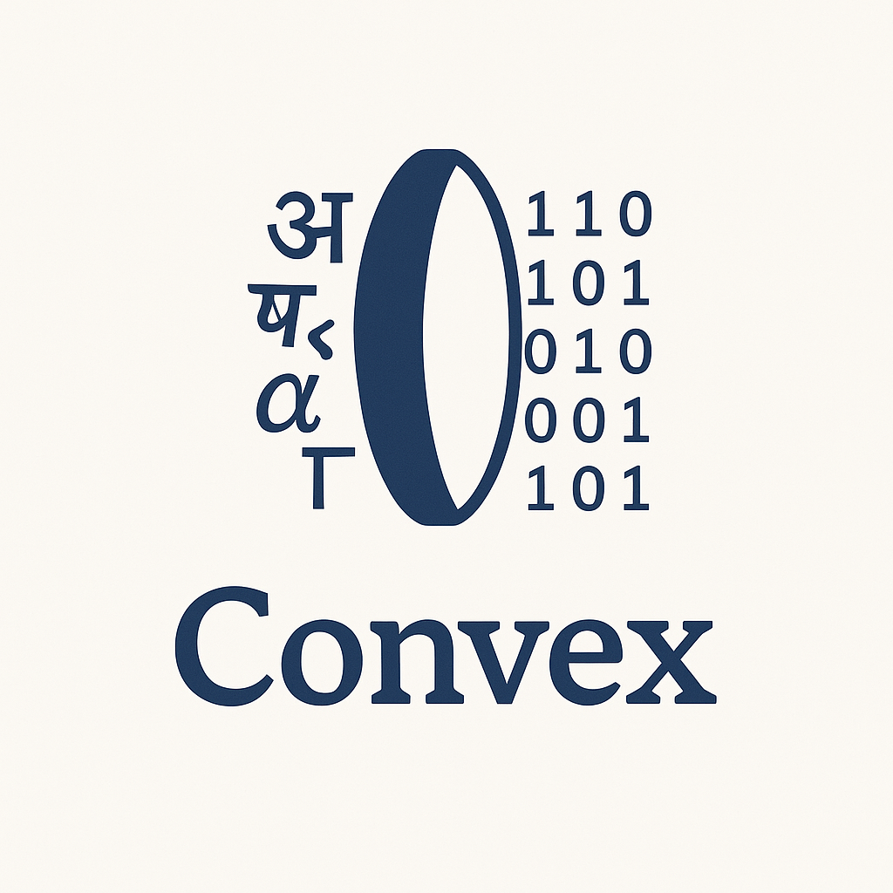

<div align="center"> <h1> 🗺️ CONVEX - WRITE YOUR PROGRAM IN YOUR OWN LANGUAGE</h1> </div>

 

<div align="center"> <h3> 🚧 UNDER ACTIVE DEVELOPMENT 🚧 </h3> </div>


## ✅ Core Idea:

Let users write **code in their native language**, and then **translate it into real code** (like Python, Java, etc.) that can be executed.


## 🧠 Basic Example

Let’s say someone writes this in Hindi:

```hindi
यदि x > 10 तब:
    प्रिंट("बड़ा है")
अन्यथा:
    प्रिंट("छोटा है")
```

This would be translated to:

```python
if x > 10:
    print("बड़ा है")
else:
    print("छोटा है")
```


## 🔧 System Architecture

1. **Input Parser (in native language)**  
    Reads code written in a user's language.
    
2. **Translator / Mapper**  
    Maps native keywords to equivalent programming keywords.
    
3. **Code Generator**  
    Outputs valid Python/Java/etc. code.
    
4. **Interpreter/Executor**  
    Runs the translated code and returns the output.
    


## 🛠️ Tools & Technologies that we can Use

| Task                | Tools                                       |
| ------------------- | ------------------------------------------- |
| Language Parsing    | `ANTLR`, `Lark`, `PLY`, `regex`             |
| Translation         | Custom dictionary / NLP                     |
| Execution           | `exec()` in Python, `JVM` for Java          |
| Frontend (optional) | Web-based editor with native script support |
| Backend             | Python or Java-based translator engine      |


## 🏗️ Step-by-Step Implementation Plan

### 1. **Design the "Native Language" Syntax**

- Define what keywords people can use in their language (Hindi, Tamil, etc.)
- Example:
    - `यदि` → `if`
    - `तब` → `:`
    - `प्रिंट` → `print`

### 2. **Build a Translator**

Use a dictionary or rule-based approach to convert native-language code into Python.

```python
native_to_python = {
    "यदि": "if",
    "तब": ":",
    "प्रिंट": "print",
    "अन्यथा": "else"
}
```

Translate line by line using replacements.

### 3. **Handle Variables, Loops, etc.**

Use regex to identify parts of the syntax:

- `यदि x > 5 तब:` → `if x > 5:`
- `जबतक i < 10:` → `while i < 10:`
### 4. **Execute Translated Code**

Use Python's `exec()` safely (with caution).

```python
translated_code = translate(hindi_code)
exec(translated_code)
```

### 5. **UI (Optional)**

Make a web app or desktop app with:

- Text area for native code input
- Display translated Python
- Show execution result/output
    

## 🌍 Multilingual Support

To support multiple Indian languages:

- Create **language packs** (Hindi, Tamil, Kannada, etc.)
- Define translation dictionaries for each
- Choose language at the start or auto-detect
    


## ⚠️ Key Challenges

- Ambiguity in natural language
- Managing indentation, syntax errors
- Handling different scripts (Devanagari, Tamil, etc.)
- Security in execution (`exec()` is dangerous without sandboxing)


## ✅ MVP Features

|Feature|Description|
|---|---|
|🈶 Native language code input|Code written in Hindi or other language|
|🔁 Translator|Maps native words to Python|
|⚙️ Executor|Runs the translated code|
|🖥️ Web Interface|Optional for ease of access|


## 🧪 Simple Proof-of-Concept Code

```python
def translate(hindi_code):
    dictionary = {
        "यदि": "if",
        "तब": ":",
        "प्रिंट": "print",
        "अन्यथा": "else"
    }
    for hindi, python in dictionary.items():
        hindi_code = hindi_code.replace(hindi, python)
    return hindi_code

user_code = """
यदि x > 5 तब:
    प्रिंट("बड़ा")
अन्यथा:
    प्रिंट("छोटा")
"""

x = 7
exec(translate(user_code))
```


## 🔐 Contribution & Branch Protection Policy

To maintain a high-quality and collaborative codebase, the `main` branch of this repository is **protected**. Please follow the simple workflow below when contributing:

### ✅ **Contribution Guidelines**

1. **Create a new branch** from `main`. Make your contributions in that branch.
2. **Push your changes** to your branch. 
3. **Open a Pull Request (PR)** targeting `main`.
4. Your PR must:
   * ✅ Receive **at least 1 code review approval**. Feel free to request the collaborators for the review.
   * 🚫 **Not be merged by the same person who made the last commit to `main`**
5. Once approved, **another contributor** (not the last committer) would soon merge the PR.

The collaborators would try their best to review and resolve the contribution as soon as possible.

Feel free to reach out to the collaborators for any queries.

### 🔄 Why This Policy?

* Ensures peer review for better code quality.
* Prevents accidental or unilateral changes to the main branch.
* Encourages shared responsibility and collaboration.

> 💡 **Note:** PRs that do not follow this process will be blocked automatically by GitHub branch protection rules.


## 🤝 Collaborators

The following are the collaborators on this repository:

- @[aditya-an1l](https://github.com/aditya-an1l/) - Project Maintainer
- @[Pranav770](https://github.com/Pranav770/) - Web App, NLP Maintainer
- @[sproutcake23](https://github.com/sproutcake23/) - Backend, NLP Maintainers
- @[sriram936](https://github.com/sriram936/) - NLP Maintainer
- @[StrikerSam-Ai](https://github.com/StrikerSam-Ai/) - Web App, QA/Testing Maintainer
- @[yashnarayan123](https://github.com/yashnarayan123/) -  Backend, DevOps Maintainers

*If you’re not yet listed here but contribute regularly, please let us know and we’ll add you!*  
